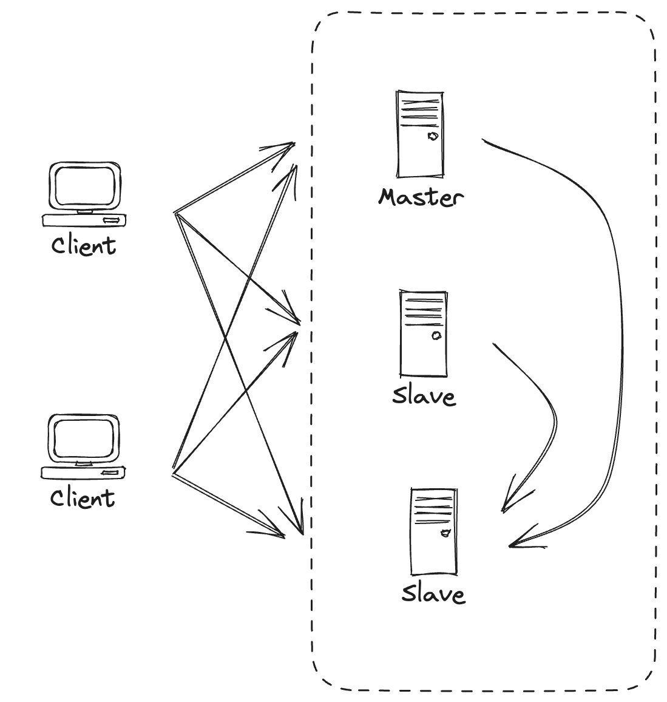

# Master-Slave architecture

Master-slave architecture is a communication model in which one device or process (the "master") has control over one or several other devices or processes (the "slaves"). In this design, the master typically initiates requests or commands, and the slaves respond to those requests.

Here's a more detailed breakdown:

### Key Characteristics:

1. **Command and Control**: The master provides commands, and the slaves execute those commands.

2. **Unidirectional Initiation**: Typically, the master initiates all communications; slaves only communicate in response to a master's request or command.

3. **Role Asymmetry**: Masters and slaves have distinct roles. The master usually has more complexity, control, and responsibility than the slaves.

### Common Uses:

1. **Databases**:
   - **Replication**: A master database can be used for writes, while slave databases handle read requests. This setup can increase read scalability. 
   - **Backup**: Slaves can serve as real-time backups of the master.

2. **Redundancy and Failover**: In some configurations, if a master fails, a slave can be promoted to take over as the new master to maintain system availability.

3. **Load Balancing**: Distributing tasks across multiple slave devices or processes can balance the system's load.

4. **Distributed Computing**: In frameworks like Hadoop's MapReduce, the master node assigns tasks to slave nodes and then aggregates the results.

5. **Embedded Systems and Hardware Design**: Master-slave relationships can be seen in protocols like SPI (Serial Peripheral Interface) or I2C, where a master device controls multiple slave devices.

### Advantages:

1. **Centralized Control**: It's easier to manage and coordinate system operations from a central master.
 
2. **Scalability**: For certain tasks (like database reads in a master-slave replicated system), you can achieve scalability by adding more slave nodes.

3. **Simplified Slave Design**: Slaves can often be simpler and cheaper, as they don't require the intelligence or decision-making capabilities of the master.

### Disadvantages:

1. **Single Point of Failure**: If the master fails, the entire system may become inoperative unless there's a failover mechanism in place.

2. **Potential Bottlenecks**: The master can become a performance bottleneck if it can't handle the volume of requests from all the slaves.

3. **Consistency Issues**: In database systems, if not managed correctly, there can be data consistency issues between the master and its replicas.

!> **Note**: The term "master-slave" has been criticized for its negative historical connotations, and many communities and organizations are moving towards more neutral terminology like "primary-replica" or "leader-follower".