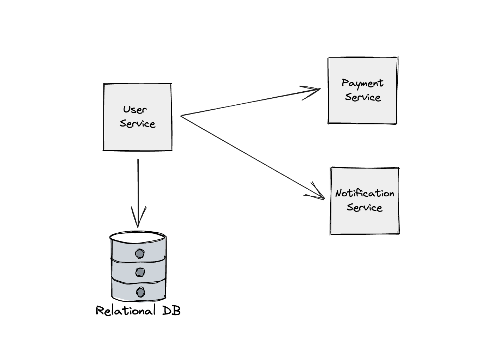

# Microservices Architecture

Microservice architecture is an architectural style for designing and developing software applications as a collection of loosely coupled and independently deployable services. In a microservices-based system, a large application is broken down into smaller, self-contained services that each perform a specific function or task. These services communicate with each other over a network, typically using lightweight protocols like HTTP or messaging systems.

Key characteristics and principles of microservice architecture include:

1. **Decomposition:** The application is divided into small, focused services that handle specific functionality or business capabilities. Each microservice should have a well-defined scope and a single responsibility.
2. **Independence:** Microservices are designed to be independent of each other. This means they can be developed, deployed, and scaled independently. Changes to one microservice do not require changes to others, promoting agility.
3. **Distributed:** Microservices are distributed and communicate over a network. This distribution enables flexibility and scalability but also introduces challenges in terms of network latency and fault tolerance.
4. **Technology Diversity:** Different microservices within an application can use different technologies, languages, and frameworks that are best suited for their specific tasks. This allows teams to choose the right tools for the job.
5. **Polyglot Persistence:** Microservices can use different databases or data storage technologies based on their requirements. This contrasts with monolithic applications that often use a single, shared database.
6. **Scalability:** Each microservice can be scaled independently to handle varying levels of traffic or load, allowing for efficient resource allocation.
7. **Resilience:** Microservices should be designed to be fault-tolerant and recover gracefully from failures. This often involves implementing redundancy and fallback mechanisms.
8. **APIs:** Microservices expose well-defined APIs (often RESTful APIs) that allow them to communicate with each other and with external clients.
9. **DevOps and Automation:** Microservices benefit from a DevOps culture and automated deployment processes to support frequent updates and releases.
10. **Organizational Structure:** The development and maintenance of microservices align with small, cross-functional teams, each responsible for one or more microservices. This promotes ownership and accountability.

Benefits of microservice architecture include improved agility, scalability, and maintainability. However, it also introduces complexities in terms of managing inter-service communication, monitoring, and versioning. Microservices are commonly used in modern software development practices, especially for cloud-native applications and services where flexibility and rapid development are essential.
