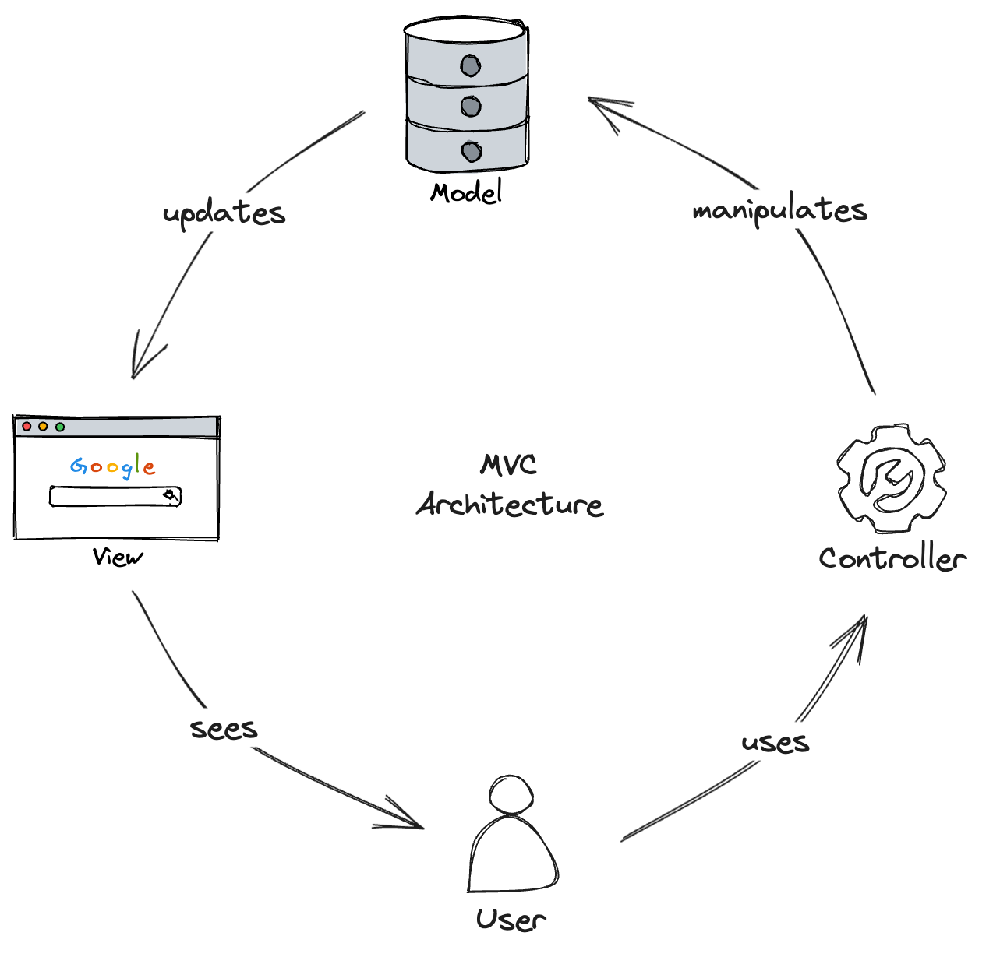

# Model-View-Controller (MVC) Architecture

MVC stands for Model-View-Controller, and it's a design pattern often used in software engineering aimed at separating an application into three interconnected components. It is especially popular in web application frameworks. Here's a breakdown of each of its components:

1. **Model**:
    - Represents the core business logic and data. 
    - It communicates to the database and updates the View whenever the data changes.
    - The Model responds to the Controller's requests to access or process data.
2. **View**:
    - Represents the UI of the application.
    - It displays data from the Model to the user and sends user commands to the Controller.
    - Think of it as everything that the user experiences visually on the webpage: buttons, text inputs, sliders, and so on.
3. **Controller**:
    - Acts as an interface between Model and View.
    - It takes the user input from the View, processes it (with potential updates to the Model), and returns the display output to the View.
    - In many cases, the user's interactions with the View trigger functions in the Controller.

### How MVC Works:

1. **User Interaction**:
    - The user interacts with the View, generating actions that are passed to the Controller.
2. **Controller's Response**:
    - The Controller receives these user actions and performs the required interaction with the Model. This could be anything from fetching data to updating information.
3. **Model's Role**:
    - Depending on what the Controller needs, the Model might be tasked with fetching/saving data or even processing information. After completing its task, the Model may notify the View of any changes.
4. **Updating the View**:
    - The View updates itself based on the data from the Model to provide feedback to the user.

### Benefits of MVC Architecture:

1. **Separation of Concerns**:
    - MVC provides a clear separation of concerns, with distinct roles for Model, View, and Controller components. This means changes in one component (e.g., UI changes in the View) can be made independently of the others.
2. **Modularity**:
    - Components can be developed and tested separately, improving modularity.
3. **Scalability**:
    - Due to its modular nature, it's easier to scale applications using the MVC pattern.
4. **Reusability**:
    - Components, especially Models and Controllers, can often be reused in different parts of the application or even in different projects.
5. **Flexibility**:
    - The View can be replaced or changed without affecting the rest of the system. This is useful when you need to change the look and feel of an application without touching the underlying logic.

Many modern web application frameworks, like- Laravel (PHP), Symfony (PHP), Django (Python), Ruby on Rails (Ruby), ASP.NET MVC (C#), Spring MVC (Java), and Angular (JavaScript/TypeScript), use the MVC pattern or variations of it.