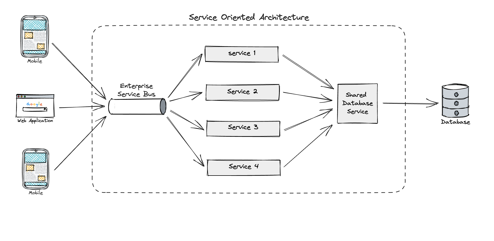
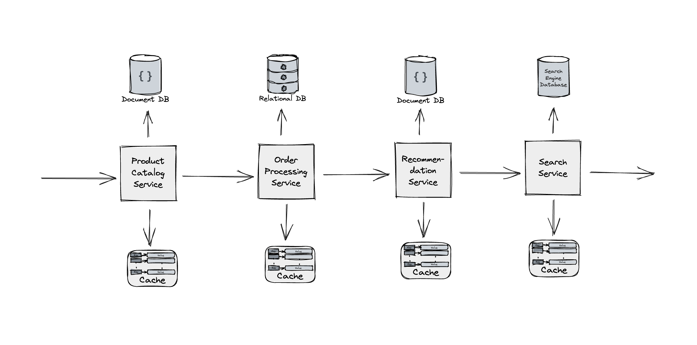

# Service Oriented Architecture

Service-oriented architecture (SOA) has been a popular architectural pattern since the early 2000s due to its flexibility, scalability, and ability to adapt to changing business needs. 

At its core, SOA is an architectural approach to software development that emphasizes the use of services to enable communication between different components of a system.

In a service-oriented architecture, services are organized around specific business functions and communicate with each other using a messaging system. Each service is self-contained and can be developed, tested, and deployed independently of other services. This allows for greater flexibility, as services can be easily swapped out or replaced without affecting the overall system.

One of the key benefits of SOA is its ability to adapt to changing business needs. By organizing services around specific business functions, developers can easily add or remove functionality as needed, without having to re-architect the entire system. This makes it easier for businesses to respond to changing market conditions, customer needs, and other external factors.

Another benefit of SOA is its ability to scale horizontally. As the system grows, additional instances of services can be deployed to handle increased traffic, without having to scale up the entire system. This allows businesses to scale more efficiently and cost-effectively, without having to invest in expensive hardware or infrastructure.

Overall, service-oriented architecture is a powerful and flexible approach to software development that can help businesses adapt to changing needs, scale efficiently, and deliver better value to their customers.

## In the System Design Interview  

One example of a system used in system design interviews that could be based on Service-oriented architecture (SOA) is an e-commerce platform, like Amazon or eBay.

In an e-commerce platform, there are many services that are organized around specific business functions, such as:

- **Product catalog service**: This service manages the catalog of products available on the platform, including information about each product, pricing, and availability.
    
- **Order processing service**: This service manages the processing of customer orders, including validating payment information, updating inventory, and generating shipping labels.
    
- **Recommendation service**: This service analyzes customer behavior and preferences to make personalized product recommendations.
    
- **Search service**: This service provides customers with the ability to search for products by keyword, category, or other criteria.
    
Each of these services can be developed, tested, and deployed independently of other services. They communicate with each other using a messaging system, which allows them to exchange data and execute business processes.

For example, when a customer places an order, the order processing service will communicate with the product catalog service to update the inventory levels of the product being purchased. The recommendation service may also be notified of the purchase and update the customer's recommendation history.

By organizing the system around specific business functions, an e-commerce platform can be more flexible and scalable. New services can be added or removed as needed, without affecting the overall system. The system can also scale horizontally by adding additional instances of services to handle increased traffic, without having to scale up the entire system. This allows the e-commerce platform to deliver better value to its customers, while also reducing costs and improving efficiency.

## vs. Microservices 

Service-oriented architecture (SOA) and [Microservices](/architecture-patterns/microservices-architecture) architecture are both architectural approaches that involve breaking down a system into smaller, more modular components. However, there are some key differences between the two.

**One of the main differences is the size and scope of the services.** 

- In SOA, services tend to be larger and more complex, often representing entire business functions or processes. 
- In microservices architecture, services tend to be smaller and more focused, representing specific functional components of the system.

**Another key difference is the way in which services communicate with each other.** 

- In SOA, services typically communicate with each other using a messaging system, such as an [Enterprise Service Bus](/system-components/enterprise-service-bus.md), which provides a centralized hub for managing communication between services. 
- In microservices architecture, services communicate with each other using lightweight protocols, such as REST or [[Message Queue]], which allow for greater flexibility and autonomy.

SOA is often associated with [Monolithic](/architecture-patterns/monolithic-architecture.md) architectures, where all services are deployed together in a single unit. In contrast, microservices architecture is associated with a more distributed architecture, where services can be deployed independently of each other, allowing for greater flexibility and scalability.

Overall, while there are some similarities between SOA and microservices architecture, the two approaches are distinct and have different strengths and weaknesses. The choice between the two will depend on the specific needs and requirements of the system being developed.
