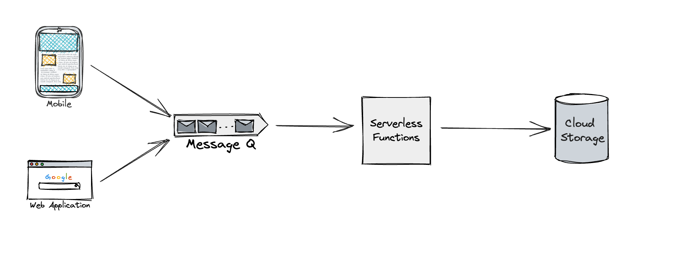

# Serverless Architecture

Serverless architecture is a design pattern where applications are built using cloud services that run and scale automatically, without the need for server management.When designing a system using serverless architecture, it's important to ensure that the different components of the system are well-defined and can work together effectively.

Architecture diagrams can be particularly useful for this, as they can help you map out the different services and functions that make up your serverless application.

Each service or function can be represented as a separate component, with clearly defined inputs and outputs. Additionally, it's important to consider how data flows through the system, and how different components interact with each other.

By using architecture diagrams to plan out your serverless application, you can ensure that each component is well-defined and that the different components work together seamlessly.