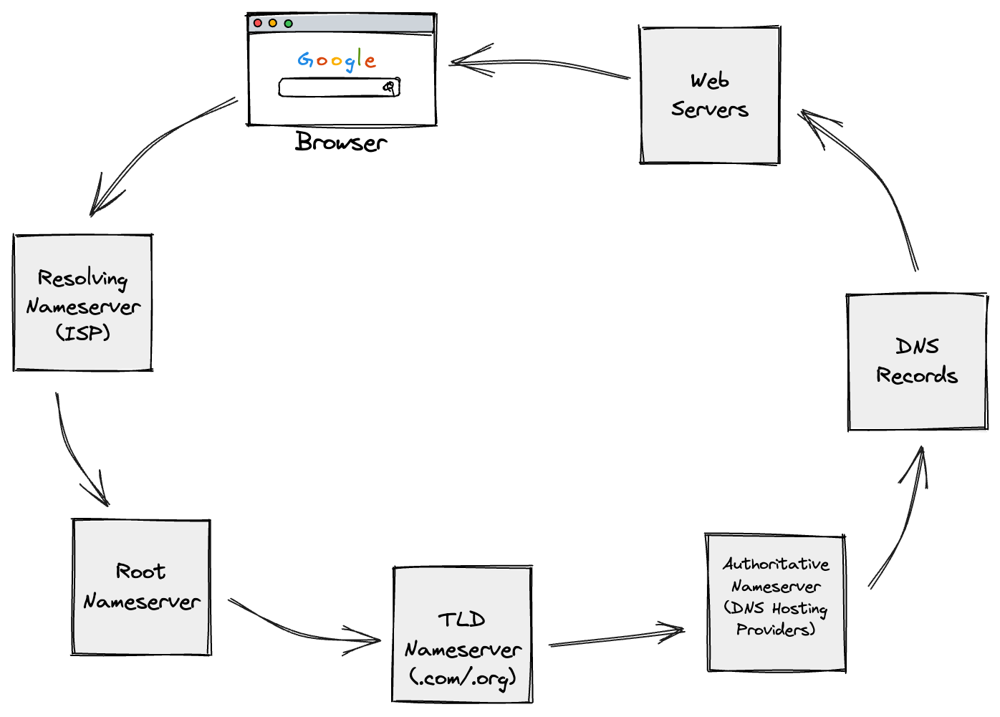

# Domain Name System (DNS)

DNS, or Domain Name System, is a critical component of the Internet that acts as a decentralized directory service. Its primary purpose is to translate human-friendly domain names, like `www.example.com`, into machine-readable IP (Internet Protocol) addresses, such as `192.0.2.1.`

Here's how DNS works:

1. **Domain Name Resolution**: When you enter a domain name into your web browser (e.g., `www.example.com`), your device sends a DNS query to a DNS resolver, typically provided by your Internet Service Provider (ISP) or a third-party DNS service like Google DNS or OpenDNS.
2. **DNS Hierarchy**: The DNS resolver searches for the corresponding IP address by querying a hierarchical system of DNS servers. This hierarchy includes:
   - Root Servers: These are the top-level servers that store information about the global structure of the DNS.
   - Top-Level Domain (TLD) Servers: These servers handle specific domain extensions like ".com," ".org," and ".net."
   - Authoritative DNS Servers: These servers store the DNS records for individual domains.
3. **Caching**: To improve efficiency, DNS resolvers often cache DNS records temporarily. If a resolver has recently resolved a domain, it can provide the IP address without needing to query the authoritative DNS servers again.
4. **Response**: Once the DNS resolver finds the IP address associated with the domain, it returns this information to your device.
5. **Connection**: Your device then uses the IP address to establish a connection with the web server hosting the website you want to visit.

DNS is crucial for the functionality of the Internet, as it enables users to access websites and other online resources using human-readable domain names, rather than having to remember complex IP addresses. It plays a vital role in the routing and delivery of data across the global network.