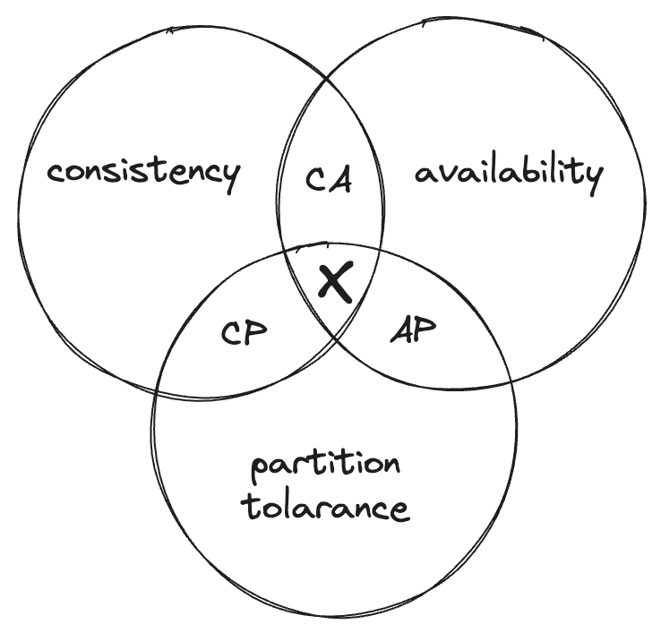

# CAP Theorem

The CAP theorem, also known as Brewer's theorem, is a fundamental principle in distributed computing that outlines the trade-offs and limitations that distributed systems must consider when it comes to three key properties: Consistency, Availability, and Partition Tolerance. It was formulated by computer scientist Eric Brewer in 2000.

Here's what each of these terms means in the context of the CAP theorem:

1. **Consistency (C)**: In a distributed system, consistency means that all nodes or servers in the system will have the same data view at the same time. In other words, if you read data from one node, and then immediately read from another, you will get the same result, reflecting the most recent write operation. Consistency ensures that the data remains synchronized across all nodes.
2. **Availability (A)**: Availability refers to the guarantee that every request made to a non-failing node in a distributed system will receive a response, without errors or timeouts. In other words, the system remains operational and responsive to user requests even in the presence of node failures or network issues.
3. **Partition Tolerance (P)**: Partition tolerance accounts for the system's ability to continue functioning even when network partitions (communication failures or delays) occur, causing some nodes to be unable to reach others. Partition tolerance is essential in distributed systems because network issues are common, and nodes might not always be able to communicate seamlessly.

The CAP theorem asserts that in a distributed system, you can only guarantee two out of these three properties at any given time. Here are the three possible combinations:

1. **CA**: If you prioritize Consistency and Availability, the system will not be able to tolerate network partitions. This means that in the event of a network partition, you must sacrifice either consistency or availability.
2. **CP**: If you prioritize Consistency and Partition Tolerance, the system may need to sacrifice availability during network partitions. In other words, if a partition occurs, you might not be able to respond to all requests.
3. **AP**: If you prioritize Availability and Partition Tolerance, the system may not guarantee strong consistency at all times. This means that in some cases, different nodes might have slightly inconsistent data due to the prioritization of availability and the acceptance of eventual consistency.

It's important to note that the CAP theorem doesn't prescribe a one-size-fits-all solution. The choice between consistency, availability, and partition tolerance depends on the specific requirements and goals of your distributed system. Different use cases may favor different combinations of these properties, and architects must carefully consider the trade-offs when designing and operating distributed systems.

### In the Interview Context

During the interview, we normally asked to design a large distributed system. So, the partition tolerance is a must requirements in almost all interview problems. You have to deside based on the requirements whether you want to go with CP or AP. If you choose CP then you have to sacrifice availability during network partitions. If you choose AP then you have to sacrifice consistency.